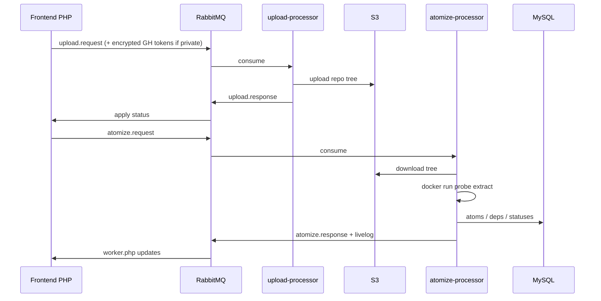
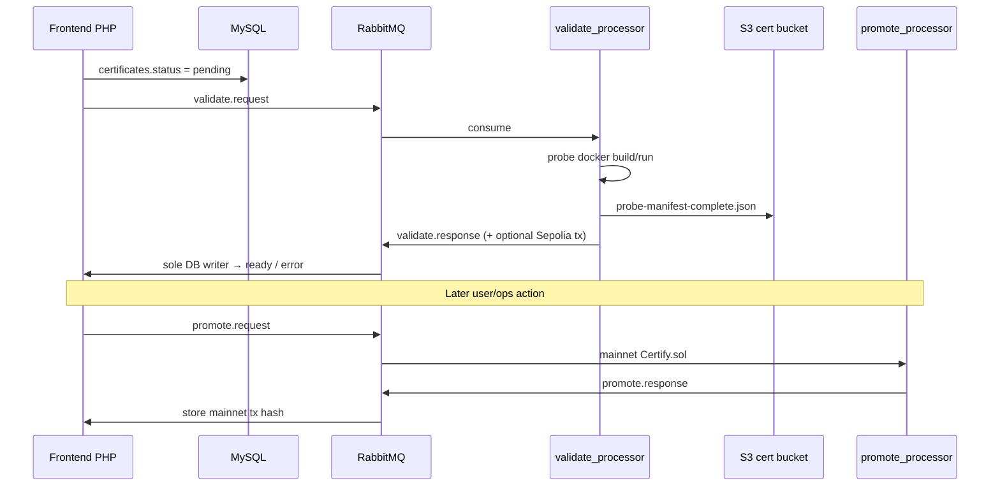

# Data flows

Concrete message and storage paths across the four platform repos.

## Upload → atomize

Details: [Processor data flow](../components/processor/data-flow.md), [queue workers](../components/processor/queue-workers.md).

## Certify → validate → promote

Details: [Cert queue](../components/cert/cert-queue.md), [worker](../components/cert/worker.md).

## CLI path

Contributor machines use [verilib-cli](../reference/scripts-and-cli.md) against the API for auth, init, deploy, pull, and local structure commands. Server-side atomize/cert work still lands in the same MySQL + queue world when the platform processes repos; CLI `--no-probe` avoids local probe invocation in CI/server modes.

## Shared contracts

| Contract | Peers |
| --- | --- |
| RabbitMQ vhost + queue args | frontend ↔ atomizer ↔ local_validate |
| `GITHUB_TOKEN_ENCRYPTION_KEY` / `JWT_KEY` | frontend ↔ upload-processor |
| `S3_BUCKET` == `S3_CERT_BUCKET` | local_validate ↔ frontend |
| Probe Schema 2.0 JSON | probes ↔ atomizer parsers |

## Related

- [System map](system-map.md)
- [Frontend API side effects](../components/ux-api/api-spec.md)
