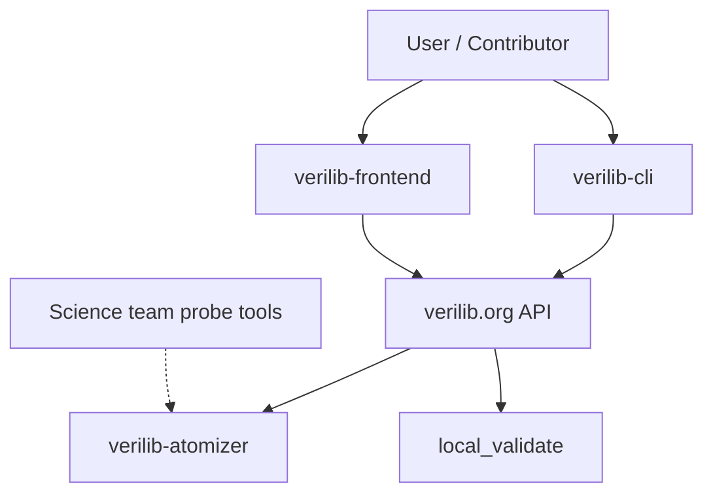

# System map

High-level view of VeriLib platform repositories and how they connect. Science-team verification tools (probe, probe-verus, benchmarks) live in separate repos under [Beneficial-AI-Foundation](https://github.com/Beneficial-AI-Foundation) and feed into the atomization pipeline.

## Platform repositories

| Component | Repository | Role |
| --- | --- | --- |
| Frontend | [verilib-frontend](https://github.com/Beneficial-AI-Foundation/verilib-frontend) | Web UI at [verilib.org](https://verilib.org) |
| CLI | [verilib-cli](https://github.com/Beneficial-AI-Foundation/verilib-cli) | Local repo init, structure files, deploy/pull |
| Atomizer | [verilib-atomizer](https://github.com/Beneficial-AI-Foundation/verilib-atomizer) | Server-side atomization and processing |
| Certificates | [local_validate](https://github.com/Beneficial-AI-Foundation/local_validate) | Certificate validation worker |

## Architecture diagram

## Data flow (summary)

1. **Contributor** uses [verilib-cli](../reference/scripts-and-cli.md) to authenticate, initialize a repo, and manage `.verilib/` structure files locally.
2. **Deploy** pushes structure and metadata to the VeriLib API ([verilib.org](https://verilib.org)).
3. **Atomizer** processes repositories server-side — atomization, probe integration, JSON mapping.
4. **local_validate** validates specification and verification certificates (mainnet, testnet, Docker Hub flows).
5. **Frontend** displays verification status, colors, and library content to users.

## Science team (out of scope for this hub)

The Beneficial AI Foundation organization hosts many additional repositories for formal verification research:

- **probe**, **probe-verus**, **probe-aeneas** — static analysis and atom extraction
- **vericoding**, **vericoding-benchmark** — verified coding tools and benchmarks
- Individual verification projects (Lean, Verus, Dafny, etc.)

Those repos document themselves; this hub indexes the **VeriLib platform** that wraps and serves verified code to the public.

## Related

- [Data flows](data-flows.md)
- [Processor: Atomizer](../components/processor/atomizer.md)
- [Certificates: Cert Queue](../components/cert/cert-queue.md)
- [UX & API: Frontend](../components/ux-api/frontend.md)
