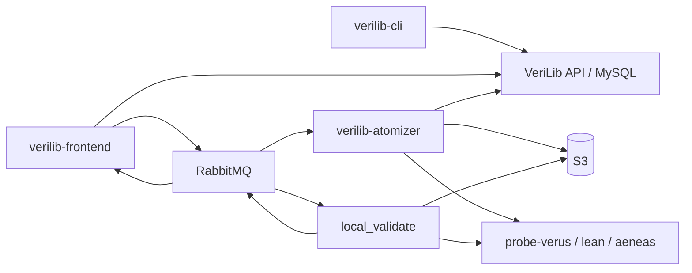

# System map

Verified end-to-end map of VeriLib **platform** repositories. Science-team probe tools are linked from Processor / Certificates docs but are not first-class hub sections.

## Platform repositories

| Component | Repository | Role |
| --- | --- | --- |
| CLI | [verilib-cli](https://github.com/Beneficial-AI-Foundation/verilib-cli) (public) | Auth, init, deploy/pull, local create/atomize/specify/verify |
| Frontend / API | [verilib-frontend](https://github.com/Beneficial-AI-Foundation/verilib-frontend) | PHP + React UX; MySQL; RabbitMQ publishers; sole cert DB writer |
| Atomizer | [verilib-atomizer](https://github.com/Beneficial-AI-Foundation/verilib-atomizer) | Upload + atomize workers; S3 + probe Docker; persist atoms |
| Certificates | [local_validate](https://github.com/Beneficial-AI-Foundation/local_validate) | Probe images + validate/promote workers (RabbitMQ + S3, no DB) |

## Architecture diagram

## Interaction model

| Path | What happens |
| --- | --- |
| **CLI → API** | Deploy / pull structure and metadata; CI often uses `--check-only` / `--no-probe` patterns |
| **UI upload / reclone** | PHP enqueues `upload.request` (private GitHub tokens on message); atomizer clones → S3 → atomize → MySQL atoms |
| **UI Certify** | PHP clones cert snapshot, `certificates.status=pending`, `validate.request`; worker runs probe, S3 manifest; PHP marks ready; optional Sepolia then separate mainnet promote |
| **Probes** | Shared extract tools; atomizer and cert workers both invoke language probe images |

## Science team (out of scope)

probe, probe-verus, probe-lean, probe-aeneas, vericoding, benchmarks, and project repos document themselves under [Beneficial-AI-Foundation](https://github.com/Beneficial-AI-Foundation).

## Related

- [Data flows](data-flows.md)
- [System overview](system-overview.md)
- [Atomizer](../components/processor/atomizer.md)
- [Cert queue](../components/cert/cert-queue.md)
- [Frontend](../components/ux-api/frontend.md)
- [Scripts and CLI](../reference/scripts-and-cli.md)
