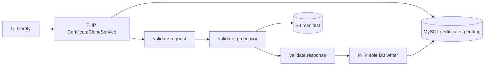

# Cert Queue

Certificate subsystem for VeriLib — probe Docker images plus RabbitMQ workers that validate certified repo snapshots and optionally anchor them on-chain.

| | |
| --- | --- |
| **Repo** | [Beneficial-AI-Foundation/local_validate](https://github.com/Beneficial-AI-Foundation/local_validate) (private; README still branded around dalek-lite probe Docker) |
| **Status** | active |

## End-to-end (Certify click)

1. User with **Certifier** permission clicks Certify ([frontend](../ux-api/permissions.md)).
2. PHP deep-clones repo rows/files, inserts `certificates` with **`status=pending`**, publishes `validate.request`.
3. Python worker (DB-free) builds/runs the probe image, uploads `probe-manifest-complete.json` to S3, streams `validate.livelog`, publishes `validate.response` (optional Sepolia anchor).
4. PHP consumes the response and is the **sole writer** of certificate rows (`ready` / error / chain fields).

Mainnet promotion is a **separate** `promote.request` → `promote_processor` pipeline.

## Hub pages

- [Probe Docker image](probe-docker-image.md) — build, manifest fetch, badges
- [Worker](worker.md) — `validate_processor` / `promote_processor`, env names
- [Testnet](testnet.md) — Sepolia on validate path
- [Mainnet](mainnet.md) — promote path / `Certify.sol`
- [Docker Hub](docker-hub.md) — publish digests
- [Verify it yourself](verify-it-yourself.md) — reproduce a published image

## Cross-repo must-match

| Value | Worker | Frontend |
| --- | --- | --- |
| RabbitMQ vhost | `RABBITMQ_VHOST` (required, no default) | same |
| Cert manifest bucket | `S3_BUCKET` | `S3_CERT_BUCKET` |
| Queue topology args | `broker/topology.py` | `BaseQueue.php` (same PR if changed) |

## Documentation source of truth

- Root [README](https://github.com/Beneficial-AI-Foundation/local_validate/blob/main/README.md) — probe image
- [`worker/README.md`](https://github.com/Beneficial-AI-Foundation/local_validate/blob/main/worker/README.md) — queue workers
