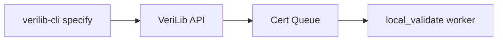

# Cert Queue

Certificate validation worker for VeriLib — processes specification and verification certificates through mainnet, testnet, and Docker Hub flows.

| | |
| --- | --- |
| **Repo** | [Beneficial-AI-Foundation/local_validate](https://github.com/Beneficial-AI-Foundation/local_validate) |
| **Owner** | _TBD_ |
| **Status** | active |

## Overview

The **local_validate** repository implements the certificate (**CERT**) subsystem. When contributors run `verilib-cli specify` or the platform validates proofs, certificate jobs are queued and processed by this worker.

Key flows documented in sibling pages:

- [Mainnet](mainnet.md) — production certificate validation
- [Testnet](testnet.md) — staging / test validation
- [Docker Hub](docker-hub.md) — container image verification
- [Verify it yourself](verify-it-yourself.md) — self-service verification

## Install

```bash
git clone https://github.com/Beneficial-AI-Foundation/local_validate.git
cd local_validate
# See repo README for worker setup
```

## How it fits



## Related

- [System map](../../architecture/system-map.md)
- [verilib-cli specify](../../reference/scripts-and-cli.md)
- [Glossary](../../project/glossary.md) — specification status

## Documentation source of truth

Detailed worker configuration and deployment: **[local_validate README](https://github.com/Beneficial-AI-Foundation/local_validate/blob/main/README.md)**
