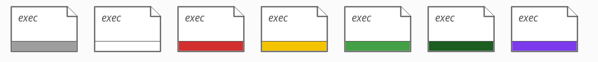
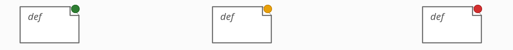

# Atom statuses and colours

The **minimal, informative colouring scheme** for atoms: for every colour it says
where the information comes from. It covers Verus and Aeneas (Rust) projects and
Lean projects, and is the mapping the [Atomizer](atomizer.md) persists and the
frontend renders from the atom [`verification-status`](json-mapping.md) field.

This scheme is **VeriLib-specific** (it is about how VeriLib presents atom
statuses, not about any individual probe), so this page is its **canonical home**
— both the definition below and the reference `count-colors.sh` implementation.

## Two visual channels

An atom carries at most two independent signals:

| Channel | Where | What it means | Which atoms |
|---------|-------|---------------|-------------|
| **Colour bar** (bottom) | Verification status | does the implementation meet its spec? | Rust `exec` |
| **Colour dot** (top-right) | Checking status | does the tool accept the artifact? | verification artifacts |

"Verification artifacts" are Verus specs and proofs, and Lean defs and theorems.
They get a **dot, not a bar**: the question for them is not "meets its spec" but
"does it go through".

The two channels split cleanly by `language` (per [P20](https://github.com/Beneficial-AI-Foundation/probe/blob/main/kb/engineering/properties.md)):
`language: "rust"` (kind `exec`) → **bar**; `language: "verus"` (Verus spec /
proof) and `language: "lean"` (any Lean atom) → **dot**.

Optional classification (scheme / construction / correctness / security) is shown
by border colour. It is not a status.

## Kind — the top-left label

The label at the top-left corner is exactly the atom's `kind` field from the
JSON, verbatim. Possible values:

- **Rust (Verus / Aeneas):** `exec`, `spec`, `proof`
- **Lean:** `def`, `abbrev`, `class`, `structure`, `inductive`, `instance`, `opaque`, `quot`, `projection`, `axiom`, `theorem`

## Colour bar — Rust `exec` (Verus and Aeneas projects)

The status rides on a **bar at the bottom** of the atom, in the seven colours
of the table below (white = an empty bar: tracked, no spec yet):



The bar is a pure function of `is-disabled` and `verification-status` on the Rust
`exec` atom (exactly what [`count-colors.sh`](#counting-count-colorssh) counts):

| Bar | JSON condition | Meaning |
|-----|----------------|---------|
| **grey** | `is-disabled: true` | disabled — out of verification scope (see below) |
| **white** | no `verification-status` | tracked — in scope, no spec yet (empty bar = intent to verify) |
| **red** | `verification-status: "failed"` | error — verification failed |
| **yellow** | `verification-status: "unverified"` | incomplete proof: a Lean `sorry` or a Verus `assume()` |
| **light green** | `verification-status: "verified"` | locally verified — meets its spec |
| **dark green** | `verification-status: "transitively-verified"` | verified, and so are all its dependencies |
| **purple** | `verification-status: "trusted"` | assumed correct (Verus `#[verifier::external_body]` / `admit()`, Lean axiom / `*External.lean`) |

The bar is what makes white unambiguous: a **white bar** means a tracked,
not-yet-specified Rust function; **no bar at all** means a pure-Rust project atom
with no verification intent, for Rust projects alone.

## Colour dot — verification artifacts

The status rides on a **dot at the top-right corner** of the artifact, a pure
function of `verification-status`:



| Dot | JSON condition | Meaning |
|-----|----------------|---------|
| **red** | `verification-status: "failed"` | fails to check |
| **yellow** | `verification-status: "unverified"` | checks, with an incompleteness warning (`sorry` / `assume`) |
| **green** | anything else (`"verified"` / `"transitively-verified"` / `"trusted"` / none) | accepted by the tool |

red/green are always from the build/verify command. Yellow is from the
command for Lean, but from the probe's source scan for Verus.

## Legend (Verus / Aeneas)

What a Rust function's bar colour means, in plain words:

- **grey — not tracked.** Deliberately outside the verification effort; ignored in every count.
- **white — tracked, not started.** In scope, no spec yet — the work backlog.
- **red — broken.** Has a spec; verification errors out.
- **yellow — in progress.** Has a spec; the verification is incomplete (a `sorry` / `assume()`).
- **light green — verified.** Verified against its spec.
- **dark green — verified end-to-end.** Verified, and so is every dependency.
- **purple — trusted.** Deliberately assumed, not verified — the trust base.

**Tracked** = every Rust function that is in verification scope = all bar colours
except grey. Every Rust function is tracked by default; one leaves the tracked
set only when the code explicitly marks it out of scope (Verus
`#[verifier::external]`; Aeneas untranslated or `@[out_of_scope]`). Progress is
`#verified / #tracked`, and a project is **done** when every tracked function is
green or purple (verified/transitively-verified, or trusted).

## Tracking and the denominator

Every Rust function is **tracked by default** (white bar). Out-of-scope is stated
explicitly in the code and read by the probes:

- **Verus** — `#[verifier::external]`, cfg-inactive code, or an external-crate
  stub → `is-disabled: true` → **grey**.
- **Aeneas** — cfg-inactive code, a non-library target (`build.rs`, `tests/`,
  `examples/`, `benches/`), a Lean-side `@[out_of_scope]` annotation on the
  translation, or a curated config `out-of-scope` entry → `is-disabled: true`
  → **grey**. Absence from `functions.json` alone is **not** out of scope: a
  compiled function Aeneas has not yet translated is **white** backlog, not
  grey (P25).

This gives a well-defined denominator, so we can report

```text
#verified / #tracked      where #tracked = all exec atoms − grey (is-disabled)
```

Excluded from every count (both channels), before any colouring: external-crate
stubs (empty `code-path`) and editorial/auto-generated exclusions
(`is-hidden` / `is-ignored` / `is-extraction-artifact`). These are not atoms the
project owes work on, so they never enter the bar or dot totals.

## Progress tracking — summary stats and chart

Two artifacts, computed only for projects with a bar channel (Verus / Aeneas);
Lean has no `tracked` denominator (see below). The partition stats derive from the
seven bar colours that [`count-colors.sh`](#counting-count-colorssh) counts;
`translated` additionally uses the Aeneas `translation-name` field.

Throughout, `#exec` means the Rust `exec` atoms that survive the exclusions above
(empty `code-path`, `is-hidden` / `is-ignored` / `is-extraction-artifact`).

### Summary (snapshot partition)

The five buckets are disjoint and sum to `tracked`:

| Stat | Definition | Colour |
|------|------------|--------|
| **tracked** | `#exec − #is-disabled` = `unspecified + failed + in-progress + verified + trusted` | all bars − grey |
| **unspecified** | no `verification-status` | white |
| **failed** | `verification-status: "failed"` | red |
| **in-progress** | `verification-status: "unverified"` — a `sorry` / `assume` | yellow |
| **verified** | `verification-status: "verified"` + `"transitively-verified"` | light + dark green |
| **trusted** | `verification-status: "trusted"` | purple |
| **translated** | non-disabled `exec` atoms with a non-null `translation-name` (Aeneas only) | — |

`translated` is **not** part of the partition — it is a milestone that cuts
across it (a verified Aeneas function is also translated).

### Progress chart (burn-up over time)

Cumulative, nested curves — not a stack-to-100%:

```text
tracked ≥ translated ≥ verified          (translated line: Aeneas only)
```

- **tracked** — the upper bound (ceiling).
- **verified** — the proved frontier.
- **verified + trusted** — the *completion frontier*; this is what reaches the
  ceiling at "done" (done = every tracked function green or purple). `trusted` is
  drawn as its own band on top of `verified`, so the purple gap — how much rests
  on axioms — stays visible rather than folded into `verified`.
- **translated** (Aeneas) — the intermediate milestone between "in scope" and
  "verified".

`in-progress` is deliberately **not** a curve here: it is a transient state (a
function leaves it the moment its `sorry` / `assume` is removed and it becomes
verified), so on a burn-up it would only ever shrink. It already shows up as the
gap between the completion frontier and the ceiling. It stays a summary slice.

Invariant to hold: `tracked ≥ translated ≥ verified` for Aeneas; for Verus the
translated line is N/A (`tracked ≥ verified` only).

## Lean projects

Lean has no notion of "tracked" (no exec side to be the denominator), so:

- **No numbers** — we do not report `#verified / #tracked`.
- Atoms carry only the **coloured dot** (red / yellow / green from `lake build`).

Richer views are possible where the project supplies more structure:

- **Verso-blueprint projects** — annotations declare what each item is meant to
  be. A dedicated **`probe-verso-blueprint`** probe would surface those
  annotations, enabling def/thm roles and progress views.
- **Security protocols formalised in Lean** — a separate question, deferred.

## Open question — statistics for artifacts

Artifacts have no "tracked" denominator (that is a bar-channel notion), but two
ratios over the theorems could still be informative:

- `#yellow / #theorems` — the fraction of theorems that still carry a `sorry` /
  `assume` (`verification-status: "unverified"`).
- `#purple / #theorems` — the fraction resting on axioms / trusted models
  (`verification-status: "trusted"`; shown as a green dot since it *checks*, but
  countable separately).

Open: whether to show these at all (they would give Lean projects some numbers,
which we otherwise avoid), and what the denominator should be — all theorems, or
all artifacts.

## Counting: `count-colors.sh`

The scheme above is implemented by the `count-colors.sh` reference script below.
It reads a probe `extract` JSON (`probe-verus`, `probe-lean`, or `probe-aeneas` —
auto-detected from the `schema` field) and prints the per-colour counts for both
channels plus the progress summary and chart frontiers.

```bash
count-colors.sh <input.json>
```

This page is the **canonical home** for the script (it is VeriLib-specific, not a
probe concern). To run it, save the block below as `count-colors.sh` and
`chmod +x` it — it needs only `jq`:

```bash
#!/usr/bin/env bash
# Count atoms per colour, split by the two visual channels of the scheme.
#
# Works with probe-aeneas/extract, probe-verus/extract, and probe-lean/extract
# JSON. Auto-detects the pipeline from the schema field.
#
# See the "Atom statuses and colours" doc for the scheme. Two channels:
#
#   Colour BAR  — Rust `exec` atoms (language "rust", kind "exec").
#     Verification status: does the implementation meet its spec?
#     Pure function of (is-disabled, verification-status):
#       Grey        is-disabled: true              (out of verification scope)
#       White       no verification-status         (tracked, no spec yet)
#       Red         "failed"
#       Yellow      "unverified"                   (sorry / assume)
#       Light Green "verified"
#       Dark Green  "transitively-verified"
#       Purple      "trusted"                      (Rust atoms only)
#     These seven partition the exec total (relies on P24: status => not-disabled).
#
#   Colour DOT  — verification artifacts: Verus "spec"/"proof" (language
#     "verus" per KB P20) and every Lean atom (language "lean"). Selected by
#     kind (spec/proof) or language (lean).
#     Checking status: does the tool (lake build / cargo verus verify) accept it?
#     Pure function of verification-status:
#       Red    "failed"        (does not check)
#       Yellow "unverified"    (checks with a sorry / assume warning)
#       Green  otherwise       (verified / transitively-verified / trusted /
#                               none — accepted by the tool)
#
# Excluded from both channels: external-crate stubs (code-path == "") and
# editorial/auto-generated exclusions (is-hidden / is-ignored /
# is-extraction-artifact).
# @kb: kb/engineering/properties.md#p24-a-status-bearing-atom-is-in-analysis-scope
#
# Usage: scripts/count-colors.sh <input.json>

set -euo pipefail

if [ $# -lt 1 ]; then
    echo "Usage: $0 <input.json>" >&2
    exit 1
fi

INPUT="$1"

if [ ! -f "$INPUT" ]; then
    echo "Error: file not found: $INPUT" >&2
    exit 1
fi

jq -r '
  .schema as $schema |
  ($schema | if startswith("probe-aeneas") then "aeneas"
             elif startswith("probe-verus") then "verus"
             elif startswith("probe-lean")  then "lean"
             else "unknown" end) as $pipeline |

  [.data[] | select(.["code-path"] != "")
           | select((.["is-hidden"] // false) | not)
           | select((.["is-ignored"] // false) | not)
           | select((.["is-extraction-artifact"] // false) | not)] as $atoms |

  # --- Colour BAR: Rust exec atoms -------------------------------------------
  ([$atoms[] | select(.language == "rust" and .kind == "exec") | {
     disabled:   (.["is-disabled"] == true),
     status:     (.["verification-status"] // null),
     translated: ((.["translation-name"] // null) != null)
   }]) as $exec |

  # --- Colour DOT: verification artifacts ------------------------------------
  # Verus spec/proof and every Lean atom. Keyed on kind, not language: per KB
  # P20 a Verus spec/proof has language "verus" (only exec is "rust"), so we
  # select spec/proof by kind and thus stay correct regardless of that tag.
  ([$atoms[] | select(
     (.kind == "spec" or .kind == "proof") or
     (.language == "lean")
   ) | (.["verification-status"] // null)]) as $art |

  {
    pipeline:    $pipeline,

    grey:        [$exec[] | select(.disabled)] | length,
    white:       [$exec[] | select(.disabled | not) | select(.status == null)] | length,
    red:         [$exec[] | select(.disabled | not) | select(.status == "failed")] | length,
    yellow:      [$exec[] | select(.disabled | not) | select(.status == "unverified")] | length,
    light_green: [$exec[] | select(.disabled | not) | select(.status == "verified")] | length,
    dark_green:  [$exec[] | select(.disabled | not) | select(.status == "transitively-verified")] | length,
    purple:      [$exec[] | select(.disabled | not) | select(.status == "trusted")] | length,
    exec_total:  ($exec | length),

    dot_red:     [$art[] | select(. == "failed")] | length,
    dot_yellow:  [$art[] | select(. == "unverified")] | length,
    dot_green:   [$art[] | select(. != "failed" and . != "unverified")] | length,
    art_total:   ($art | length)
  } |

  (.grey + .white + .red + .yellow + .light_green + .dark_green + .purple) as $bar_cover |
  (.dot_red + .dot_yellow + .dot_green) as $dot_cover |
  (.exec_total - .grey) as $tracked |
  (.light_green + .dark_green) as $verified |
  (.light_green + .dark_green + .purple) as $verified_trusted |
  # Translated: non-disabled exec atoms with a translation-name (Aeneas only).
  # Counted within tracked so the invariant tracked >= translated >= verified holds.
  ([$exec[] | select(.disabled | not) | select(.translated)] | length) as $translated |

  "Pipeline: \(.pipeline)",
  "",
  "Colour BAR — Rust exec atoms (verification status)",
  "# | Color       | Count",
  "--|-------------|------",
  "1 | Grey        | \(.grey)",
  "2 | White       | \(.white)",
  "3 | Red         | \(.red)",
  "4 | Yellow      | \(.yellow)",
  "5 | Light Green | \(.light_green)",
  "6 | Dark Green  | \(.dark_green)",
  "7 | Purple      | \(.purple)",
  "--|-------------|------",
  "  | Total       | \(.exec_total)",
  "",
  "Progress tracking (see the Atom statuses and colours doc)",
  "",
  "  Summary (snapshot partition; sums to tracked):",
  "    unspecified (white):              \(.white)",
  "    failed      (red):                \(.red)",
  "    in-progress (yellow):             \(.yellow)",
  "    verified    (light + dark green): \($verified)",
  "    trusted     (purple):             \(.purple)",
  "    ----------------------------------",
  "    tracked     (total - grey):       \($tracked)",
  "",
  "  Chart (cumulative frontiers; tracked >= translated >= verified):",
  "    tracked            (upper bound): \($tracked)",
  "    translated         (Aeneas only): \($translated)",
  "    verified                        : \($verified)",
  "    verified + trusted   (frontier) : \($verified_trusted)",
  (if $tracked > 0 then
    "    (verified + trusted) / tracked  : \($verified_trusted) / \($tracked)"
  else empty end),
  "",
  "Colour DOT — verification artifacts (checking status)",
  "# | Color  | Count",
  "--|--------|------",
  "1 | Red    | \(.dot_red)",
  "2 | Yellow | \(.dot_yellow)",
  "3 | Green  | \(.dot_green)",
  "--|--------|------",
  "  | Total  | \(.art_total)",
  (if $bar_cover != .exec_total then
    "  WARNING: bar colours (\($bar_cover)) != exec total (\(.exec_total))"
  else empty end),
  (if $dot_cover != .art_total then
    "  WARNING: dot colours (\($dot_cover)) != artifact total (\(.art_total))"
  else empty end),
  # Invariant tracked >= translated >= verified (Aeneas only; for Verus
  # translated is always 0 while verified may be > 0, so the check is scoped
  # to the Aeneas pipeline). A verified Aeneas function should carry a
  # translation-name; a violation means malformed input.
  (if .pipeline == "aeneas" and $translated < $verified then
    "  WARNING: translated (\($translated)) < verified (\($verified)) — a verified Aeneas atom is missing translation-name"
  else empty end)
' "$INPUT"
```

## Related

- [JSON mapping](json-mapping.md) — the atom fields (`verification-status`, `is-disabled`, `kind`, `language`) this scheme reads
- [Atomizer](atomizer.md) — persists atom statuses to MySQL
- [Languages and plugins](languages-and-plugins.md) — the probes that emit these statuses
