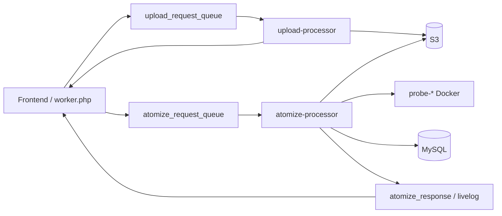

# Data flow

## Production (queue)

1. **Upload** — clone (or paste) source; for private GitHub, decrypt tokens from the message `source`; upload tree to S3; respond with `s3_uri` / commit metadata.
2. **Atomize** — download from S3; `docker run` language probe; find `.verilib/probes/*_*.json`; parse; persist atoms/deps; update verification statuses; publish response + livelog.

Wire contracts: upstream `docs/protocols/upload.md` and `docs/protocols/atomize.md`.

## Per-repo atomize steps (`atomizer.py`)

1. Run probe extract (or accept an existing JSON path).
2. `parser.find_probe_output()` / `parse_file()`.
3. Extract code bodies (files, then DB text fallback).
4. Persist atoms + dependencies.
5. Update `codes` verification status; mark repo completed or error.

## Legacy poll mode

Older `main.py` polls MySQL for `repos.status_id = 1` (pending), runs a thread pool (`MAX_WORKERS`), retries up to `MAX_RETRIES`, then sets status `2` (completed) or `3` (error). Prefer queue workers for new environments.

## Related

- [Queue workers](queue-workers.md)
- [Architecture data flows](../../architecture/data-flows.md)
