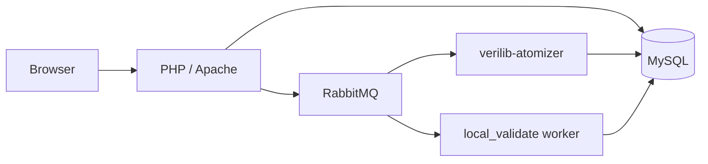

# Frontend

Web application for [verilib.org](https://verilib.org) — browse verified code, manage uploads, view verification status, and trigger certification.

| | |
| --- | --- |
| **Repo** | [Beneficial-AI-Foundation/verilib-frontend](https://github.com/Beneficial-AI-Foundation/verilib-frontend) (private) |
| **Stack** | PHP + MySQL, Tailwind/Gulp assets, React graph app (`react-graph-standard/`) |
| **Status** | active |

## What this repo owns

| Owns | Does not own |
| --- | --- |
| HTTP UX (PHP pages + React repo browser) | Probe execution / atomization workers ([atomizer](../processor/atomizer.md)) |
| Auth, roles, task permissions | Certificate probe Docker image ([certificates](../cert/cert-queue.md)) |
| MySQL schema + enqueue of `upload` / `validate` work | CLI client ([scripts and CLI](../../reference/scripts-and-cli.md)) |
| RabbitMQ publishers from the web app | Science-team probe repos |

Upload and certify actions create DB rows and publish queue messages; workers in other repos claim and complete the work.

## High-level request paths

- **Upload / reclone / reatomize** — PHP enqueues work for the atomizer (private GitHub tokens are copied encrypted onto the queue payload; see upstream `docs/private-github-upload-processor.md`).
- **Certify** — `POST repobrowser/certify` clones a certificate snapshot, leaves `certificates.status = pending`, and publishes a validate request for the cert worker.

## Hub pages in this section

- [Local development](local-dev.md) — Compose ports, `.env`, full stack profile
- [Tech stack](tech-stack.md) — PHP/MySQL, Gulp/Tailwind, React, Playwright
- [React rewrite](react-rewrite.md) — `react-graph-standard/` Vite app
- [Roles](roles.md) / [Permissions](permissions.md)
- [API spec](api-spec.md) — `/v2/...` surface used by the React app

## Documentation source of truth

Detailed setup and deploy scripts: **[verilib-frontend README](https://github.com/Beneficial-AI-Foundation/verilib-frontend/blob/main/README.md)** (private repo access required).
