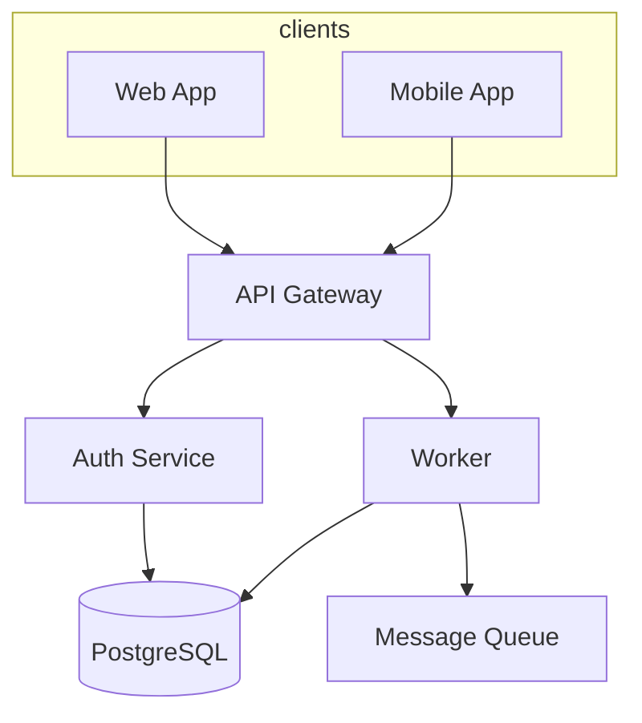

# Documentation Standard

A reusable Markdown schema for multi-repository projects with shared infrastructure, multiple maintainers, and mixed audiences (developers, ops, QA, and external contributors).

---

## 1. Principles

1. **Docs-as-code** — Markdown in Git, reviewed via PR, versioned with releases.
2. **One hub, many repos** — A central docs repository indexes the system; each component repo holds detailed docs.
3. **Single source of truth** — Details live in the component repo; the hub links and summarizes.
4. **Role-aware** — Different templates for dev, ops, and QA; everyone knows what to update.
5. **Diátaxis** — Organize content by purpose: Tutorial, How-to, Reference, Explanation.
6. **No secrets in docs** — Document secret *names* and *locations*, never values.

---

## 2. Repository Layout

### 2.1 Hub repository (`project/docs` or `project/website`)

```
docs/
├── README.md                         # Documentation home
├── architecture/
│   ├── overview.md                   # High-level system description
│   ├── system-map.md                 # Repos, services, dependencies
│   └── adr/                          # Architecture Decision Records
│       ├── README.md
│       └── 0001-example-decision.md
├── components/                       # One file per service/component
│   ├── api-gateway.md
│   ├── auth-service.md
│   └── worker.md
├── tutorials/                        # Learning-oriented (first-time setup)
│   └── getting-started.md
├── how-to/                           # Task-oriented guides
│   ├── add-a-new-service.md
│   └── rotate-api-keys.md
├── reference/                        # API, config keys, env vars, CLI
│   ├── api/
│   ├── config/
│   └── env-vars.md
├── runbooks/                         # Ops procedures (may be private repo)
│   ├── deploy-production.md
│   └── incident-response.md
├── qa/
│   ├── release-checklist.md
│   └── test-plans/
│       └── feature-example.md
├── contributing/
│   ├── how-to-write-docs.md
│   ├── code-of-conduct.md
│   └── templates/                    # Copy-paste templates (this file)
└── incidents/                        # Post-mortems (optional, may be private)
    └── INC-YYYY-MMDD-001-example.md
```

### 2.2 Component repository (each sub-project)

```
component-name/
├── README.md                         # 5-minute quick start
├── CONTRIBUTING.md
├── CHANGELOG.md
├── docs/
│   ├── COMPONENT.md                  # Component card (sync with hub)
│   ├── RUNBOOK.md                    # Ops runbook for this repo
│   ├── adr/                          # ADRs scoped to this repo
│   └── api.md                        # Optional detailed API docs
└── .github/
    └── PULL_REQUEST_TEMPLATE.md      # Includes docs checklist
```

### 2.3 Private vs public split


| Audience                 | Location                         | Examples                                                       |
| ------------------------ | -------------------------------- | -------------------------------------------------------------- |
| **Public (open source)** | Hub repo, public component docs  | Architecture, API reference, contributing                      |
| **Internal (ops/team)**  | Private repo or `docs-internal/` | Production credentials map, on-call runbooks, incident history |


Use the same Markdown format in both; only access differs.

---

## 3. Conventions

### 3.1 File naming


| Type           | Pattern                             | Example                              |
| -------------- | ----------------------------------- | ------------------------------------ |
| Component card | `components/{slug}.md`              | `components/auth-service.md`         |
| How-to guide   | `how-to/{verb-noun}.md`             | `how-to/rotate-api-keys.md`          |
| ADR            | `adr/NNNN-{kebab-title}.md`         | `adr/0003-use-postgres-for-queue.md` |
| Runbook        | `runbooks/{topic}.md`               | `runbooks/deploy-production.md`      |
| Test plan      | `qa/test-plans/{feature}.md`        | `qa/test-plans/oauth-login.md`       |
| Incident       | `incidents/INC-{YYYYMMDD}-{seq}.md` | `incidents/INC-20260721-001.md`      |


- Use **kebab-case** for filenames.
- ADR numbers are **zero-padded 4 digits**, never reused.
- Slugs match repo/service names where possible.

### 3.2 Frontmatter (required on hub and component docs)

Every `COMPONENT.md`, `RUNBOOK.md`, ADR, test plan, and incident file starts with YAML frontmatter:

```yaml
---
title: Auth Service
component: auth-service
repo: https://github.com/org/auth-service
owner: @dev-username
ops_owner: @ops-username
status: active              # active | deprecated | experimental
last_reviewed: 2026-07-21
related:
  - api-gateway
  - user-db
ports: [8080]
---
```


| Field           | Required              | Notes                                                   |
| --------------- | --------------------- | ------------------------------------------------------- |
| `title`         | Yes                   | Human-readable name                                     |
| `component`     | Yes                   | Stable slug, matches filename                           |
| `repo`          | Yes on component docs | Link to source repo                                     |
| `owner`         | Yes                   | Dev maintainer (GitHub handle)                          |
| `ops_owner`     | On runbooks           | Ops/on-call owner                                       |
| `status`        | Yes                   | `deprecated` docs get a banner, not deleted immediately |
| `last_reviewed` | Yes                   | Must be updated on every substantive edit               |
| `related`       | Recommended           | Cross-links to other components                         |
| `ports`         | If applicable         | For service catalog                                     |


### 3.3 Linking

- **Hub → component:** `[Auth Service](./components/auth-service.md)` or absolute URL to published site.
- **Component → hub:** `See [system map](https://docs.example.com/architecture/system-map)`.
- **Cross-repo:** Always use full GitHub/GitLab URLs or published doc URLs, not relative paths across repos.
- **Anchors:** Use explicit headings; avoid brittle line-number references.

### 3.4 Status banners

Add at the top of body when applicable:

```markdown
> **Deprecated** — Replaced by [new-service](../components/new-service.md). Removal planned Q4 2026.

> **Experimental** — API unstable; not for production use.
```

### 3.5 Review cadence


| Document        | Max age before review                              |
| --------------- | -------------------------------------------------- |
| `COMPONENT.md`  | 90 days                                            |
| `RUNBOOK.md`    | 90 days                                            |
| `system-map.md` | 90 days                                            |
| ADR             | Immutable after `accepted`; supersede with new ADR |
| `README.md`     | On every release affecting setup                   |


### 3.6 PR rule

**No doc update = not done.** PRs that change behavior, config, ports, dependencies, or deployment must update the relevant docs in the same PR (or linked PR to hub repo).

---

## 4. Content Types (Diátaxis)


| Type            | Folder          | Audience      | Example                                    |
| --------------- | --------------- | ------------- | ------------------------------------------ |
| **Tutorial**    | `tutorials/`    | New users     | "Run the full stack locally in 15 minutes" |
| **How-to**      | `how-to/`       | Practitioners | "Add a new microservice to the mesh"       |
| **Reference**   | `reference/`    | Lookup        | API endpoints, env vars, config schema     |
| **Explanation** | `architecture/` | Understanding | Why event sourcing, system boundaries      |


Do not mix types in one file. A tutorial should not become an API reference.

---

## 5. Templates

Copy these into `docs/contributing/templates/` or use directly when onboarding contributors.

---

### 5.1 README.md (every repository — **Developer**)

```markdown
# {Component Name}

> {One sentence: what it does and who uses it.}

## Status

| | |
|---|---|
| **Owner** | @username |
| **Repo** | `{org/repo}` |
| **Port(s)** | `:8080` |
| **Depends on** | postgres, redis |
| **Used by** | api-gateway, admin-ui |

## Quick start (5 min)

```bash
git clone https://github.com/org/{repo}.git
cd {repo}
cp .env.example .env
docker compose up -d
# → http://localhost:8080/health
```

## Stop / restart

```bash
docker compose down
docker compose restart {service}
```

## Configuration


| File          | Purpose                     |
| ------------- | --------------------------- |
| `.env`        | Local environment variables |
| `config.yaml` | Application config          |


## Logs


| Log         | Location                                       |
| ----------- | ---------------------------------------------- |
| Application | `logs/app.log` or `docker compose logs -f app` |


## Documentation

- [Component card](./docs/COMPONENT.md)
- [Runbook](./docs/RUNBOOK.md)
- [Hub docs](https://docs.example.com/components/{slug})

## Contributing

See [CONTRIBUTING.md](./CONTRIBUTING.md).

```

---

### 5.2 COMPONENT.md (component card — **Developer + Ops**)

```markdown
---
title: {Component Name}
component: {slug}
repo: https://github.com/org/{repo}
owner: @dev
ops_owner: @ops
status: active
last_reviewed: YYYY-MM-DD
related: []
ports: [8080]
---

# {Component Name}

## Purpose

{2–3 sentences: business and technical role in the system.}

## Architecture

```mermaid
flowchart LR
  Client --> Gateway
  Gateway --> {Component}
  {Component} --> DB[(PostgreSQL)]
```

## Repository

- **Repo:** `{org/repo}`
- **Default branch:** `main`
- **Deploy path / image:** `{describe}`

## Dependencies

### Upstream (must be running first)


| Service    | Endpoint | Health check     |
| ---------- | -------- | ---------------- |
| PostgreSQL | `:5432`  | `pg_isready`     |
| Redis      | `:6379`  | `redis-cli ping` |


### Downstream (depends on this component)


| Consumer    | Integration   |
| ----------- | ------------- |
| api-gateway | HTTP REST     |
| worker      | message queue |


## Interfaces


| Type     | URL / path                | Auth                    |
| -------- | ------------------------- | ----------------------- |
| HTTP API | `http://host:8080/api/v1` | JWT                     |
| Metrics  | `/metrics`                | none (internal network) |
| Config   | `config.yaml`             | —                       |


## Secrets


| Secret         | Storage            | Access   |
| -------------- | ------------------ | -------- |
| `DATABASE_URL` | Vault / K8s secret | dev, ops |
| `API_KEY`      | CI secrets         | ops only |


> Never commit secret values. Document names and storage location only.

## Startup order

1. Database and cache
2. This component
3. Dependent services

## Common failures


| Symptom       | Likely cause              | Fix                                  |
| ------------- | ------------------------- | ------------------------------------ |
| 503 on health | DB unreachable            | Check connection string, restart DB  |
| High latency  | Connection pool exhausted | Scale replicas or increase pool size |


## Change impact


| If you change…     | Also update…                                  | Owner     |
| ------------------ | --------------------------------------------- | --------- |
| Port or health URL | Hub `system-map.md`, load balancer config     | dev + ops |
| Public API         | `reference/api/`, consumer docs               | dev       |
| Env vars           | `reference/env-vars.md`, deployment manifests | dev + ops |


## QA smoke test

- Service starts without errors
- `GET /health` returns 200
- Critical user flow works (describe)
- Downstream consumers still connect

## Links

- [Runbook](./RUNBOOK.md)
- [ADRs](./adr/README.md)
- [Hub component page](https://docs.example.com/components/{slug})

```

---

### 5.3 RUNBOOK.md (**Ops**)

```markdown
---
title: Runbook — {Component}
component: {slug}
ops_owner: @ops
last_reviewed: YYYY-MM-DD
severity_default: P2
---

# Runbook: {Component}

## Service info

| | |
|---|---|
| **Environment(s)** | production, staging |
| **Host / cluster** | `{describe}` |
| **Port** | `:8080` |
| **Process / container** | `{name}` |
| **Orchestration** | Kubernetes / systemd / Docker Compose |

## Health check

```bash
curl -sf http://localhost:8080/health || echo FAIL
```

## Start / stop / restart

```bash
# Docker Compose
docker compose up -d {service}
docker compose stop {service}
docker compose restart {service}

# Kubernetes
kubectl rollout restart deployment/{name} -n {namespace}
```

## Logs

```bash
docker compose logs -f {service}
# or
kubectl logs -f deployment/{name} -n {namespace}
```

## Deploy

```bash
# Describe your deploy command or pipeline trigger
./scripts/deploy.sh production
```

## Rollback

```bash
# Example
kubectl rollout undo deployment/{name} -n {namespace}
# or
git checkout {last-good-tag} && ./scripts/deploy.sh production
```

## Alerts and symptoms


| Alert / symptom  | Severity | Action                                  |
| ---------------- | -------- | --------------------------------------- |
| Service down     | P1       | Restart → check logs → escalate @dev    |
| Error rate > 5%  | P1       | Check recent deploy, rollback if needed |
| Disk usage > 90% | P2       | Clear logs/cache, expand volume         |


## Escalation

1. On-call ops (15 min)
2. Component owner @dev (30 min)
3. Engineering lead

## Maintenance windows

- **Preferred:** {day/time UTC}
- **Requires downtime:** yes / no

## Post-incident

After any P1/P2: file an incident report using [INCIDENT template](../contributing/templates/INCIDENT.md).

```

---

### 5.4 ADR — Architecture Decision Record (**Developer / Tech lead**)

```markdown
---
adr: 0001
title: {Short decision title}
status: proposed          # proposed | accepted | deprecated | superseded
date: YYYY-MM-DD
deciders: [@lead, @dev]
affected_components: [auth-service, api-gateway]
supersedes: null
superseded_by: null
---

# ADR-0001: {Title}

## Context

{What problem are we solving? What constraints exist?}

## Decision

{What we decided, in clear statements.}

## Consequences

### Positive
- …

### Negative
- …

## Alternatives considered

| Option | Pros | Cons | Why rejected |
|--------|------|------|--------------|
| A | | | |
| B | | | |

## Follow-up tasks

- [ ] Update affected `COMPONENT.md` files
- [ ] Update hub `architecture/overview.md`
- [ ] Migrate production by {date}
```

**ADR rules:**

- Once `accepted`, do not edit the decision text — supersede with a new ADR.
- Index all ADRs in `architecture/adr/README.md`.

---

### 5.5 TEST-PLAN.md (**QA**)

```markdown
---
title: Test plan — {Feature or Release}
component: {slug}
qa_owner: @qa
version: v1.2.0
last_updated: YYYY-MM-DD
---

# Test plan: {Feature}

## Scope

**In scope:** …  
**Out of scope:** …

## Prerequisites

- [ ] Staging environment available
- [ ] Test accounts configured
- [ ] Dependencies running (list)

## Smoke tests (must pass before merge)

| ID | Step | Expected result | Pass |
|----|------|-----------------|------|
| S1 | Open app URL | Login page loads | ☐ |
| S2 | Login with test user | Dashboard loads | ☐ |
| S3 | Call health endpoint | HTTP 200 | ☐ |

## Regression

| ID | Area | Step | Expected | Pass |
|----|------|------|----------|------|
| R1 | Auth | Logout and re-login | Session restored | ☐ |
| R2 | API | Create resource | 201 + valid body | ☐ |

## Cross-component checks

| Change in | Verify in |
|-----------|-----------|
| auth-service API | api-gateway routing |
| New env var | deployment manifest + docs |

## Sign-off

| Role | Name | Date | OK |
|------|------|------|-----|
| Developer | | | ☐ |
| QA | | | ☐ |
| Ops | | | ☐ |
```

---

### 5.6 RELEASE-CHECKLIST.md (**Dev + Ops + QA**)

```markdown
# Release checklist — {version}

## Pre-release

- [ ] CHANGELOG updated in all affected repos
- [ ] ADR written if architecture changed
- [ ] `COMPONENT.md` `last_reviewed` bumped where behavior changed
- [ ] No secrets in commits
- [ ] Smoke and regression tests pass (link: …)
- [ ] Migration scripts reviewed and reversible

## Deploy

- [ ] Notify stakeholders of maintenance window (if needed)
- [ ] Stop or drain dependent services (order: …)
- [ ] Deploy components in order: {A → B → C}
- [ ] Run database migrations
- [ ] Health checks green

## Post-release

- [ ] Monitor error rates and logs for 30 minutes
- [ ] Verify critical user flows in production
- [ ] Announce release / update status page
- [ ] Close release ticket
```

---

### 5.7 INCIDENT.md (**Ops — post-mortem**)

```markdown
---
incident_id: INC-20260721-001
severity: P2                    # P1 | P2 | P3
component: auth-service
date: 2026-07-21
author: @ops
status: resolved                # investigating | mitigated | resolved
---

# Incident: {Short title}

## Summary

{1–2 sentences: what happened and user impact.}

## Timeline (with timezone)

| Time | Event |
|------|-------|
| 14:00 | Alert: elevated 5xx rate |
| 14:05 | On-call acknowledged |
| 14:20 | Root cause identified |
| 14:30 | Mitigation applied |
| 15:00 | Resolved |

## Impact

- **Users affected:** …
- **Duration:** …
- **Data loss:** none / describe

## Root cause

…

## Resolution

…

## Action items

| Action | Owner | Due | Done |
|--------|-------|-----|------|
| Add missing health check alert | @ops | | ☐ |
| Fix connection leak | @dev | | ☐ |
| Update runbook | @ops | | ☐ |
```

---

### 5.8 system-map.md (hub — **Lead / Developer**)

```markdown
---
title: System map
last_reviewed: YYYY-MM-DD
---

# System map

## Repositories

| Component | Repo | Owner | Port | Docs |
|-----------|------|-------|------|------|
| API Gateway | `org/api-gateway` | @dev1 | 443 | [card](../components/api-gateway.md) |
| Auth Service | `org/auth-service` | @dev2 | 8080 | [card](../components/auth-service.md) |
| Worker | `org/worker` | @dev3 | — | [card](../components/worker.md) |

## Dependency diagram



## Startup order

1. Infrastructure: database, cache, queue
2. Core services: auth, worker
3. Edge: api-gateway
4. Observability: metrics, logging agents

## Shared configuration touchpoints


| Config / contract   | Repos affected                    |
| ------------------- | --------------------------------- |
| API gateway routes  | api-gateway, all backend services |
| Shared env vars doc | all services                      |
| Service discovery   | infra, all services               |


```

---

## 6. Who Maintains What

| Document | Primary | Reviewer | Trigger |
|----------|---------|----------|---------|
| `README.md` | Developer | Ops | Setup or install changes |
| `COMPONENT.md` | Developer | Ops, QA | Behavior, deps, or interface changes |
| `RUNBOOK.md` | Ops | Developer | Deploy process or incident learnings |
| ADR | Developer | Tech lead | Any architectural decision |
| Test plan | QA | Developer | New feature or release |
| Release checklist | Release manager | Dev, Ops, QA | Every release |
| Incident report | Ops | Tech lead | P1/P2 incidents |
| `system-map.md` | Tech lead | Dev, Ops | New repo or dependency change |
| API reference | Developer | — | API changes |

---

## 7. Pull Request Checklist

Add to `.github/PULL_REQUEST_TEMPLATE.md`:

```markdown
## Documentation

- [ ] No behavior change → N/A
- [ ] Updated `README.md` (if setup changed)
- [ ] Updated `docs/COMPONENT.md` (if behavior, deps, or ports changed)
- [ ] Updated `docs/RUNBOOK.md` (if deploy/ops changed)
- [ ] Updated hub `system-map.md` (if cross-repo impact)
- [ ] Added/updated ADR (if architectural decision)
- [ ] Updated `CHANGELOG.md`
- [ ] Bumped `last_reviewed` in edited doc frontmatter
- [ ] No secrets committed
```

---

## 8. Publishing (optional)


| Tool                   | Best for                                |
| ---------------------- | --------------------------------------- |
| **MkDocs Material**    | Fast setup, great search, Markdown-only |
| **Docusaurus**         | Versioned docs, i18n, large sites       |
| **VitePress / Nextra** | Lightweight modern sites                |
| **GitHub Pages**       | Zero-cost hosting from hub repo         |


Recommended: hub repo builds static site on merge to `main`; component repos link to published URLs.

---

## 9. Onboarding Checklist for New Contributors

- Read hub `architecture/overview.md` and `system-map.md`
- Clone your component repo; complete `README` quick start
- Read your component's `COMPONENT.md` and `RUNBOOK.md`
- Know who `owner` and `ops_owner` are for your area
- Before your first PR: read `contributing/how-to-write-docs.md`

---

## 10. Minimum Viable Documentation (Week 1)

1. Create hub repo with `system-map.md` and one `components/*.md` per service.
2. Add `docs/COMPONENT.md` and `docs/RUNBOOK.md` to each existing repo.
3. Add PR checklist (Section 7).
4. Assign an `owner` and `ops_owner` to every component.
5. Schedule 90-day doc review reminders (calendar or CI stale-doc check).

---

*This file is a standalone standard. Copy sections into your hub repo or hand to developers, ops, and QA as the contribution spec.*